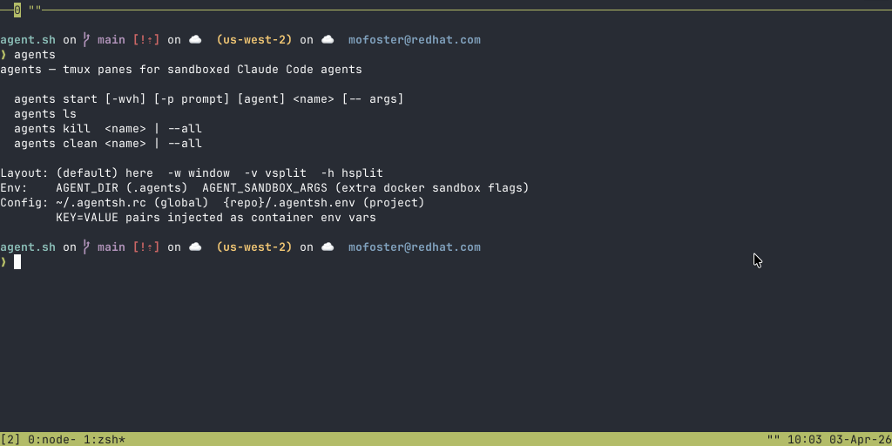

# agent.sh

A ~280-line bash script that runs Claude Code agents in Docker sandboxes. The sub-agents are managed via passing messages through tmux panes. Skills exist for producing pull requests when work finishes. This is a simple but powerful approach to orchestration. Allowing for highly parallelized workstreams.

**Why not use** `docker sandbox run` directly? It doesn't support `--env` flags, can't access host credentials, and loses state on restart. `agent.sh` supports environment variable injection into sandboxes, meaning things like `gh` and VERTEX work.



## Quick start

```bash
source agent.sh

# spin up an agent in a new tmux pane
agents start -v my-agent

# it creates a git worktree, a docker sandbox, injects your env vars,
# copies your gcloud ADC, and launches claude with --dangerously-skip-permissions.
# if the sandbox already exists, it resumes with --continue.
```

## Vertex AI / GCP setup

Set your Vertex env vars in any of three places (highest priority last):

| Layer | File | Scope |
|-------|------|-------|
| Global defaults | `~/.agentsh.rc` | All repos |
| Project overrides | `{repo}/.agentsh.env` | This repo |
| Shell environment | `export VAR=val` | This session |

```bash
# Example ~/.agentsh.rc
CLAUDE_CODE_USE_VERTEX=1
CLOUD_ML_REGION=us-east5
ANTHROPIC_VERTEX_PROJECT_ID=my-project
```

GCloud Application Default Credentials are automatically copied into the sandbox.

## Usage

```
agents start [-wvh] [-p prompt] [-m model] [agent_type] <name> [-- args]
agents ls
agents kill  <name> | --all
agents msg   <name> | --all <message>
agents clean <name> | --all
```

| Flag | Effect |
|------|--------|
| `-w` | New tmux window |
| `-v` | Vertical split |
| `-h` | Horizontal split |
| `-p "prompt"` | Write task to `CLAUDE.md` in the worktree |
| `-m model` | Override `ANTHROPIC_MODEL` for this agent |

Agent types: `claude` (default), `codex`, `gemini`, `opencode`

## Model selection

Override the model an agent uses with `-m`:

```bash
agents start -v -m claude-opus-4-6 my-agent
```

Priority chain (highest wins):

1. `-m` flag
2. Shell environment (`export ANTHROPIC_MODEL=...`)
3. Project config (`{repo}/.agentsh.env`)
4. Global config (`~/.agentsh.rc`)

## Skills

Claude Code slash commands that work with agent.sh:

| Skill | Description |
|-------|-------------|
| `/orchestrate` | Split a task into parallel agents and start them |
| `/merge` | Open GitHub PRs for agent branch work |

Install skills globally with `make install`.

## How it works

1. **Git worktree** — each agent gets an isolated branch at `.agents/<name>/`
2. **Docker sandbox** — `create` + `exec` (not `run`) so we can pass `-e` flags
3. **Env injection** — three-tier config (global, project, shell) forwarded into the container
4. **Credentials** — gcloud ADC copied into the worktree since sandboxes can't see host paths
5. **Resume** — if the sandbox already exists, `--continue` picks up where it left off; if that fails, falls back to a fresh start
6. **Tmux** — wraps everything in labeled panes/windows for easy management
7. **Messaging** — `agents msg <name> <message>` sends keystrokes to an agent's tmux window; `--all` broadcasts to every agent
